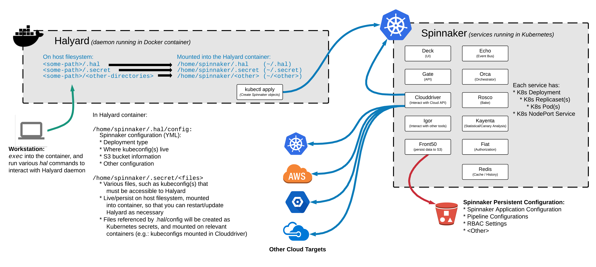
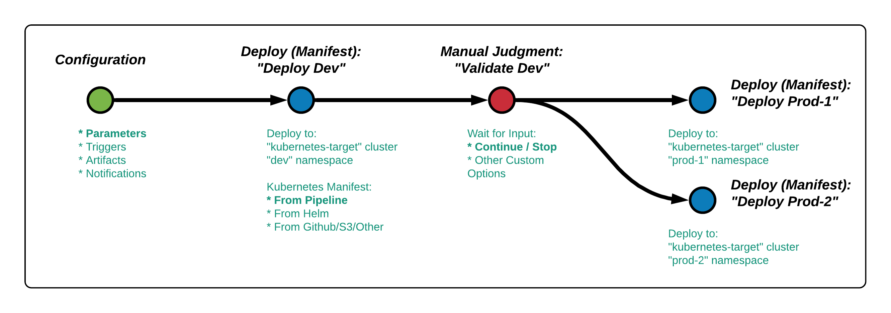

# Standing Up Spinnaker in 30mins or Less
### Slides ([pdf](assets/Stand%20Up%20Spinnaker%20in%2030mins%20or%20less%202019-APR-04.pdf))

## Step 1: Setup your Infrastructure
Setup steps for the webinar are available in [Webinar Setup / Prerequisites](01-prerequisites.md).

## Step 2: Install Halyard & Spinnaker
The steps used to install Spinnaker during the webinar are available in [Webinar - Install Spinnaker](02-install-spinnaker.md).
### Diagram of Halyard and Spinnaker

### Diagram of Exposing Spinnaker

## Step 3: Adding a Kubernetes Deployment Target
The steps used to add the second Kubernetes cluster as a deployment target are available in [Webinar - Add Kubernetes Deployment Target](03-add-kubernetes-target.md).
### Diagram of Adding a Kubernetes Cluster

## Step 4: Building a Simple Pipeline
The steps to add the demo pipeline are available in [Webinar - Demo Pipeline](04-demo-pipeline.md)
### Diagram of a Simple Pipeline
